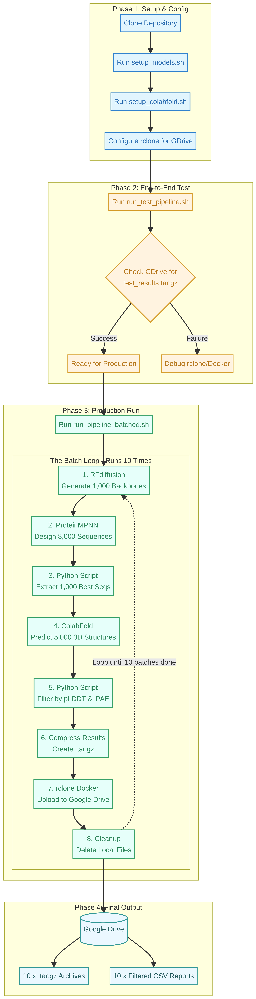

# BoNT/A Protein Binder Design Pipeline



This repository contains a fully automated, end-to-end computational pipeline for designing *de novo* protein binders against the Botulinum Neurotoxin Type A (BoNT/A) target. 

The pipeline integrates state-of-the-art deep learning models—**RFdiffusion**, **ProteinMPNN**, and **ColabFold (AlphaFold2)**—into a streamlined, batched process designed to run on a single NVIDIA GPU server (e.g., 16GB T4) with limited storage capacity.

---

## 📚 Educational Resources

If you are new to computational protein design or Docker, please start by reading the comprehensive tutorials in the `docs/educational/` folder:
1. [**Protein Design Masterclass**](docs/educational/TUTORIAL_OVERVIEW.md): A deep dive into the theory behind RFdiffusion, ProteinMPNN, and AlphaFold2.
2. [**Docker Implementation Masterclass**](docs/educational/DOCKER_MASTERCLASS.md): Why we use Docker instead of Conda, and how GPU passthrough works.
3. [**Pipeline Blueprint**](docs/PIPELINE_BLUEPRINT.md): The scientific methodology, data flow, and justification for all filtering thresholds (e.g., pLDDT > 80, iPAE < 10).

---

## ⚙️ Prerequisites

To run this pipeline, you need:
- A Linux server with an **NVIDIA GPU** (minimum 16GB VRAM recommended).
- **Docker** installed and your user added to the `docker` group (no `sudo` required for running the pipeline).
- **NVIDIA Container Toolkit** installed for GPU passthrough.
- A **Google Drive** account to store the final outputs (the pipeline uses `rclone` via Docker to automatically upload results and save local disk space).

---

## 🚀 Quick Start Guide

### 1. Clone the Repository
```bash
git clone https://github.com/smrhosseini1993/protein-binder-design-tutorial.git
cd protein-binder-design-tutorial/pipeline
```

### 2. Download Model Weights
Run the setup scripts to download the necessary neural network weights and pull the Docker images. You only need to do this once.
```bash
chmod +x setup_models.sh setup_colabfold.sh
./setup_models.sh
./setup_colabfold.sh
```

### 3. Configure Google Drive (rclone)
Because the pipeline generates massive amounts of data (up to 50GB for 10,000 designs), it automatically compresses and uploads each batch to Google Drive before deleting the local files.

Run this command to configure the `rclone` Docker container:
```bash
mkdir -p ~/.config/rclone
docker run -it --rm -v ~/.config/rclone:/config/rclone rclone/rclone config
```
*Follow the interactive prompts to create a new remote named exactly **`gdrive`**. Since you are on a headless server, you will need to authenticate using a web browser on your personal laptop when prompted.*

---

## 🧪 Running the End-to-End Test

Before committing to a massive run, it is highly recommended to run the test pipeline. This will execute **5 batches of 10 designs** to verify that all models work, GPU passthrough is functioning, and the Google Drive upload is successful.

```bash
cd pipeline
./run_test_pipeline.sh
```
**Expected Output:** Check your Google Drive for a folder named `BoNTA_Binder_Project`. You should see 5 `.tar.gz` archives and 5 `.csv` filtering reports.

---

## 🏭 Production Run (10,000 Designs)

Once the test is successful, you can start the full production run. The master script is configured to run **10 batches of 1,000 designs**.

```bash
cd pipeline
./run_pipeline_batched.sh
```

### What happens during a batch?
1. **RFdiffusion:** Generates 1,000 3D backbones.
2. **ProteinMPNN:** Designs 8 sequences per backbone (8,000 total).
3. **Extraction:** A Python script selects the single best sequence per backbone based on MPNN score.
4. **ColabFold:** Predicts the 3D structure of the 1,000 best sequences using 5 AlphaFold2 models (5,000 total predictions).
5. **Filtering:** A Python script evaluates the results and generates a CSV report of designs that pass the strict thresholds (`pLDDT > 80`, `iPAE < 10`, `RMSD < 2.0`).
6. **Upload & Cleanup:** The results are compressed, uploaded to Google Drive, and the raw local files are deleted to free up space for the next batch.

---

## 📁 Repository Structure

```text
├── docs/
│   ├── educational/          # Tutorials on Protein Design and Docker
│   ├── PIPELINE_BLUEPRINT.md # Scientific methodology and data flow
│   └── SESSION_LOG.md        # Development history
├── images/                   # Diagrams and flowcharts
├── pipeline/                 # Executable code
│   ├── inputs/               # Target PDB files (e.g., trimmed.pdb)
│   ├── scripts/              # Python utilities (filtering, extraction)
│   ├── run_*.sh              # Execution scripts for each tool
│   └── setup_*.sh            # Environment setup scripts
└── README.md                 # This file
```
