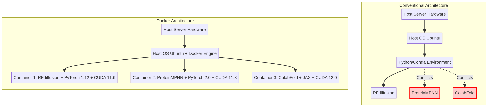
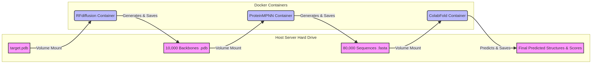

# Docker Implementation Masterclass: From Conda to Containerized Protein Design

Welcome to the Docker Implementation Masterclass. This guide is specifically designed for researchers transitioning from traditional Python/Conda workflows (like those used in medical image classification) to modern, containerized pipelines for computational structural biology. 

We will use the "given before new" pedagogical method: starting with the workflow you already know, and mapping it directly to the Docker paradigm.

---

## Part 1: The Paradigm Shift (Conda vs. Docker)

### The Familiar Workflow
Let's start with what you already know. In your previous work with CNNs and PET MPI Polar maps, your workflow likely looked something like this:

1.  **Connect:** Open VS Code and SSH into your remote server.
2.  **Code:** Run `git pull` to download the latest scripts.
3.  **Environment:** Run `conda create -n myenv python=3.9` and `conda install pytorch torchvision torchaudio cudatoolkit=11.3 -c pytorch`.
4.  **Execute:** Open a `tmux` session, activate the environment, and run `python train.py`.

This workflow is excellent for projects where you control the entire stack. You build the environment, you write the code, and you run it. 

### The "Dependency Hell" Problem
Now, let's look at our current objective: running RFdiffusion, ProteinMPNN, and ColabFold. 

If you try to use the familiar Conda workflow for this pipeline, you will immediately crash into what developers call "Dependency Hell." 

*   **RFdiffusion** was built in early 2023. It requires an older version of PyTorch (e.g., 1.12), a specific version of CUDA (e.g., 11.6), and highly specific versions of deep learning geometry libraries like DGL (Deep Graph Library).
*   **ProteinMPNN** is older and much lighter, but it might require PyTorch 2.0 to run optimally on newer hardware.
*   **ColabFold** doesn't even use PyTorch. It uses JAX, which has entirely different requirements for how it talks to the NVIDIA GPU, requiring specific cuDNN system libraries.

If you try to install all three of these into a single Conda environment, Conda will fail to resolve the conflicts. If you try to install them into three *separate* Conda environments, you will likely break your server's base NVIDIA drivers trying to juggle three different system-level CUDA toolkits.

### What is Docker?
Docker is the solution to Dependency Hell. 

Instead of trying to install software *onto your server's operating system*, Docker allows you to download a completely isolated, pre-configured "mini-computer" that runs *inside* your server. 

**Think of it like this:**
Imagine you need to test three different medical imaging software suites. 
*   **The Conda Approach:** You try to install all three suites onto your single Windows laptop. They overwrite each other's registry keys and eventually your laptop blue-screens.
*   **The Docker Approach:** You buy three separate, cheap laptops. You install Suite A on Laptop 1, Suite B on Laptop 2, and Suite C on Laptop 3. They never touch each other. When you are done, you throw the laptops in the trash.

In Docker terminology, these "mini-computers" are called **Containers**. 

Unlike Virtual Machines (VMs), which emulate an entire hardware stack and are incredibly slow, Docker Containers share the host server's underlying Linux kernel. This means they boot up in milliseconds and run at exactly the same speed as native code, with zero performance loss on your T4 GPU.

*(See the diagram below for a visual comparison of the architectures).*



### Why this matters for Protein Design
By using Docker, we don't have to install PyTorch, JAX, or DGL on your server at all. We simply tell Docker: *"Download the exact mini-computer that the Baker Lab used to write RFdiffusion, and run my `trimmed.pdb` file through it."* 

This guarantees that the code will run on your server exactly as it ran on the original authors' machines.

---

## Part 2: The Core Vocabulary & Essential Commands

Before we can run the pipeline, you need to understand the language of Docker. If you try to blindly copy-paste commands without knowing these terms, you will quickly get lost when something goes wrong. This section will serve as your permanent cheat sheet.

### 1. Image vs. Container (The Most Important Distinction)
This is the single most common point of confusion for beginners, and it is crucial to understand the difference.

*   **An Image** is the *blueprint*. It is a massive, read-only file (often 5GB to 15GB for deep learning) that contains the operating system (like Ubuntu 20.04), the programming language (Python 3.9), the libraries (PyTorch, CUDA), and the actual application code (RFdiffusion). You download Images from the internet. You cannot "run" an Image directly, just like you cannot live inside a blueprint. Images are built in "layers"—if two different images both use Ubuntu 20.04 as their base, Docker is smart enough to only store the Ubuntu layer once on your hard drive, saving space.
*   **A Container** is the *physical house* built from the blueprint. When you tell Docker to "run" an Image, it creates a Container. The Container is a live, running process. It has its own isolated file system, its own network interface, and its own isolated environment. You can have five different Containers all running at the same time, all built from the exact same Image, and they will not interfere with each other.

*Analogy:* If an Image is the `class` definition in Python, a Container is the instantiated `object` of that class. If an Image is an `.exe` installer file, the Container is the running program in your Task Manager.

### 2. Docker Hub / Registries
Just as GitHub is the central repository for code, **Docker Hub** (and other container registries like GitHub Container Registry, `ghcr.io`) is the central repository for Docker Images. 

When you type `docker pull ubuntu`, Docker automatically connects to Docker Hub, finds the official Ubuntu image, and downloads it to your server. For our pipeline, we will be pulling images created by the scientific community specifically for these tools.

### 3. The Essential Command Cheat Sheet
Here are the commands you actually need to know to manage your server. I have included snippets directly from the Docker documentation, annotated for your specific use case.

#### A. Downloading the Blueprint
```bash
docker pull <image_name>:<tag>
```
*What it does:* Downloads the Image to your server's hard drive. The `<tag>` usually specifies the version. If you omit the tag, Docker defaults to `:latest`.
*Example:* `docker pull rfdiffusion/rfdiffusion:latest`
*Pro Tip:* For scientific reproducibility, it is often better to pull a specific version tag (e.g., `:v1.1.0`) rather than `:latest`, so your pipeline doesn't break if the authors update the tool unexpectedly.

#### B. Checking Your Disk Space
```bash
docker images
```
*What it does:* Lists all the blueprints currently downloaded on your server, showing their repository name, tag, image ID, and most importantly, their **Size**.
*Why you need it:* Deep learning images are **huge**. If your server only has 100GB of storage, and you download three 15GB images, you are going to run out of space quickly. This command helps you see what is eating your disk.

#### C. Seeing What is Running
```bash
docker ps
```
*What it does:* Lists all currently running Containers. This is exactly like running `top` or `htop` in Linux, but specifically for Docker. It shows the Container ID, the Image it was built from, how long it has been running, and the command it is executing.
*Why you need it:* If you start a 10,000-design run, you use this command to verify that the container is actually alive and processing data.

```bash
docker ps -a
```
*What it does:* The `-a` stands for "all". It lists running containers AND containers that have crashed or finished. 
*Why you need it:* If your run fails silently, `docker ps -a` will show you the container with an "Exited (1)" status code, letting you know something broke. An "Exited (0)" status means it finished successfully.

#### D. Getting Inside a Running Container
```bash
docker exec -it <container_id> /bin/bash
```
*What it does:* This is an incredibly powerful debugging tool. It opens an interactive terminal (`-it`) *inside* the running container. 
*Why you need it:* If RFdiffusion is throwing a weird Python error, you can use this command to "SSH" into the container, look at the files, run `python` interactively, and figure out what is wrong without stopping the run.

#### E. Cleaning Up (Crucial for limited storage)
```bash
docker rm <container_id>
```
*What it does:* Deletes a stopped Container. (This does *not* delete the Image blueprint). You must stop a container before you can remove it, or use `docker rm -f` to force-kill and remove it.

```bash
docker rmi <image_id>
```
*What it does:* Deletes the massive Image blueprint from your hard drive to free up space. You cannot remove an image if there are any containers (even stopped ones) that were built from it.

```bash
docker system prune -a
```
*What it does:* The nuclear option. This deletes ALL stopped containers, ALL unused networks, and ALL images that are not currently being used by a running container. 
*Why you need it:* When your server's hard drive hits 99% capacity, running this command will often instantly free up 50GB of space by clearing out old, forgotten Docker experiments.

#### F. Watching the Output
```bash
docker logs -f <container_id>
```
*What it does:* If you start a container in the background (detached), you can't see the `print()` statements. This command attaches your terminal to the container's output stream. The `-f` stands for "follow", meaning it will stream the logs live, exactly like `tail -f`. Press `Ctrl+C` to stop watching (this does not stop the container, just stops the log stream).

---

## Part 3: The Step-by-Step Workflow (Translating Conda to Docker)

Now that we know the vocabulary, let's look at exactly how you will execute the 10,000-design pipeline on your T4 server using VS Code and `tmux`. We will translate your familiar Conda workflow into the Docker paradigm step-by-step.

### Step 1: The Setup (This stays exactly the same)
The beauty of Docker is that it doesn't change how you interact with your server at a high level. You will still:
1. Open VS Code.
2. Use the Remote-SSH extension to connect to your T4 server.
3. Open a terminal inside VS Code.
4. Clone the GitHub repository we are building together:
```bash
git clone https://github.com/smrhosseini1993/protein-binder-design-tutorial.git
cd protein-binder-design-tutorial
```

### Step 2: Volume Mounting (The Most Critical Concept)
Before we run the execution command, we must deeply understand **Volume Mounting**. If you misunderstand this, you will lose your data.

By default, a Docker Container is completely isolated. It has its own virtual hard drive. If you run RFdiffusion inside a container, it will generate 10,000 PDB files *inside its own isolated virtual hard drive*. When the container finishes its task and shuts down, **all 10,000 files are instantly deleted and lost forever.** The container takes its virtual hard drive to the grave with it.

To fix this, we use a Volume Mount (the `-v` flag). 
A Volume Mount punches a "hole" through the container wall, mapping a physical folder on your real server to a virtual folder inside the container. 

**The Syntax:** `-v /path/on/host/server:/path/inside/container`

If we use `-v /home/ubuntu/protein-binder-design-tutorial/data:/app/data`, here is what happens:
1. The container boots up and thinks it has a folder called `/app/data`.
2. The Python script inside the container saves `design_1.pdb` to `/app/data`.
3. Because of the Volume Mount, Docker intercepts that save operation and physically writes the file to `/home/ubuntu/protein-binder-design-tutorial/data` on your real server.
4. When the container dies, the virtual `/app/data` folder is destroyed, but the files safely remain on your real server.

*(See the diagram below to visualize how the three containers pass data through your server's hard drive).*



### Step 3: The Execution Command (`docker run`)
In your old workflow, you would type `conda activate myenv` and then `python run_rfdiffusion.py`. 
In the Docker workflow, you skip the environment activation entirely. Instead, you use a massive `docker run` command. 

Let's break down exactly what the script in our `experiments/` folder will be doing under the hood. This is the exact command you will use to run RFdiffusion:

```bash
docker run --rm \
  --gpus all \
  -u $(id -u):$(id -g) \
  -v /home/ubuntu/protein-binder-design-tutorial/data:/app/data \
  rfdiffusion/rfdiffusion:latest \
  inference.output_prefix=/app/data/outputs/design inference.num_designs=10000
```

**Line-by-Line Breakdown:**
*   `docker run`: The fundamental command to create a new Container from an Image.
*   `--rm`: **"Remove."** This tells Docker to automatically delete the Container the second it finishes running. This keeps your server clean and prevents your `docker ps -a` list from filling up with hundreds of dead containers.
*   `--gpus all`: **The Magic GPU Flag.** By default, Docker cannot see your hardware. It doesn't know you have an NVIDIA T4. This flag bridges the NVIDIA drivers from your host server into the container, allowing PyTorch to see and use the GPU. *(Note: This requires the NVIDIA Container Toolkit to be installed on your server, which is covered in the setup guide).*
*   `-u $(id -u):$(id -g)`: **The User Flag.** This is a crucial security and usability flag. We will discuss this deeply in Part 4. It prevents the output files from being locked by the `root` user.
*   `-v /home/.../data:/app/data`: **The Volume Mount.** As discussed above, this connects your real hard drive to the container.
*   `rfdiffusion/rfdiffusion:latest`: The name of the Image blueprint to use. Docker will look for this locally; if it doesn't have it, it will automatically pull it from Docker Hub.
*   `inference.output_prefix...`: Everything *after* the image name is the actual command passed *into* the container. This overrides the container's default behavior. Here, we are passing the specific Hydra configuration arguments to the RFdiffusion Python script, telling it to generate 10,000 designs and save them to the mounted folder.

### Step 4: Tmux and Detachment
Because 10,000 designs will take ~10 days on a single T4 GPU, you cannot just run this in a standard VS Code terminal. If your laptop goes to sleep, your internet connection drops, or you close VS Code, the SSH session will terminate, the terminal will close, and the Docker container will be killed instantly.

The workflow to prevent this is exactly the same as your Conda workflow:
1.  Type `tmux new -s rfdiff_run` to open a persistent terminal session on the server.
2.  Run the bash script: `bash experiments/01_run_rfdiffusion.sh` (which contains the massive `docker run` command above).
3.  Watch the output for a few minutes to ensure the first few designs are generating correctly and no errors are thrown.
4.  Press `Ctrl+B`, then `D` to detach from the tmux session. The session is now running safely in the background.
5.  Close VS Code, turn off your laptop, and go about your day.
6.  Tomorrow, SSH back in, type `tmux attach -t rfdiff_run`, and check the progress!

---

## Part 4: Critical Analysis & Challenges (The "Gotchas")

While Docker solves Dependency Hell, it introduces its own set of unique challenges. Here are the specific "gotchas" you need to be aware of when running a 10,000-design experiment.

### 1. The Storage Footprint (Image Bloat)
**The Challenge:** Deep learning Docker Images are massive because they contain an entire Ubuntu OS, PyTorch, and gigabytes of CUDA libraries. 
*   RFdiffusion Image: ~8 GB
*   ProteinMPNN Image: ~4 GB
*   ColabFold Image: ~10 GB
Just downloading the tools will consume ~22 GB of your server's storage before you even generate a single protein.

**The Solution:** You must actively monitor your disk space using `df -h` and `docker images`. If your server only has 50GB of storage, we will have to download one image, run it, delete the image (`docker rmi`), and then download the next one. 

### 2. The "Trapped Data" Problem
**The Challenge:** As mentioned in Part 3, if you misspell the path in your Volume Mount (e.g., `-v /home/ubntu/data:/app/data` instead of `ubuntu`), Docker will not throw an error. It will just silently create an empty folder, run for 10 days, save 10,000 designs inside the container, and then delete them all when it finishes.

**The Solution:** This is why we **always run a pilot experiment first**. We will run the script for 10 designs, wait 5 minutes, and explicitly check your VS Code file explorer to physically verify that the `.pdb` files are appearing on your host server.

### 3. The Root Permission Nightmare
**The Challenge:** By default, the process inside a Docker Container runs as the `root` user (the ultimate superadmin). When RFdiffusion saves a `.pdb` file to your volume-mounted `data/` folder, that file will be owned by `root`. 
When you try to open that file in VS Code (which is logged in as the normal `ubuntu` user), VS Code will say: "Permission Denied. You cannot read or edit this file."

**The Solution:** We must pass the `-u $(id -u):$(id -g)` flag in our `docker run` command. 
*   `id -u` gets your current user ID (e.g., 1000).
*   `id -g` gets your current group ID (e.g., 1000).
This flag forces the container to run as *you*, ensuring that all 10,000 output files are owned by you, and can be freely opened, moved, or deleted in VS Code.

### 4. Experiment Size & Scaling (I/O Bottlenecks)
**The Challenge:** Generating 10,000 backbones is fine. But when ProteinMPNN generates 8 sequences per backbone, you now have 80,000 `.fasta` files. When ColabFold predicts structures for all of them, you have 80,000 `.pdb` files and 80,000 `.json` score files. 
Having 240,000 tiny files in a single folder will cause the Linux file system to crawl to a halt. Running `ls` in that folder might take 30 seconds.

**The Solution:** We will design the Python scripts in our `src/` folder to automatically parse the JSON scores, extract the numbers into a single `results.csv` file, and then immediately zip/compress the `.pdb` and `.json` files into a single archive. This keeps the file count low and the server responsive.

---

### Conclusion
You now understand the paradigm shift. You know that an Image is a blueprint and a Container is the running process. You understand how Volume Mounting saves your data, and how the User Flag prevents permission nightmares. 

If you are comfortable with these concepts, we are ready to move to the final phase: deploying the actual codebase to your GitHub repository and running the pilot!

### 5. The "Zombie Container" Problem
**The Challenge:** Sometimes, a container crashes or you press `Ctrl+C` to stop it, but the container doesn't actually die. It becomes a "zombie" process that continues to hold onto your GPU memory. If you try to start a new run, PyTorch will throw a `CUDA Out of Memory` error because the zombie container is still hoarding the VRAM.
**The Solution:** You must manually hunt down and kill the zombie. 
1. Run `docker ps` to find the container ID.
2. Run `docker stop <container_id>`. If it refuses to stop, use the force kill command: `docker rm -f <container_id>`.
3. Run `nvidia-smi` to verify that the GPU memory has been freed. If `nvidia-smi` still shows memory being used but `docker ps` is empty, you may need to restart the Docker daemon (`sudo systemctl restart docker`) or, in extreme cases, reboot the server.

---

## Part 5: Putting It All Together (The Full Terminal Sequence)

To solidify everything you've learned, here is the exact sequence of commands you will type into your VS Code terminal to run the entire pipeline from start to finish. This is what your actual workflow will look like.

### Phase 1: Preparation
```bash
# 1. SSH into your server and clone the repository
git clone https://github.com/smrhosseini1993/protein-binder-design-tutorial.git
cd protein-binder-design-tutorial

# 2. Check your disk space before downloading massive images
df -h

# 3. Pull the required Docker images (this will take a while)
docker pull rfdiffusion/rfdiffusion:latest
docker pull ghcr.io/dauparas/proteinmpnn:latest
docker pull ghcr.io/sokrypton/colabfold:latest
```

### Phase 2: Execution (RFdiffusion)
```bash
# 4. Start a tmux session so the run survives if you disconnect
tmux new -s rfdiff_run

# 5. Run the RFdiffusion bash script (which contains the massive docker run command)
bash experiments/01_run_rfdiffusion.sh

# 6. Detach from tmux (Ctrl+B, then D) and let it run for 10 days.
```

### Phase 3: Monitoring and Resuming
```bash
# 7. A few days later, SSH back in and reattach to check progress
tmux attach -t rfdiff_run

# 8. If the server crashed and the tmux session is gone, don't panic!
# Just start a new tmux session and run the script again. 
# The script is designed to be resumable and will pick up where it left off.
tmux new -s rfdiff_resume
bash experiments/01_run_rfdiffusion.sh
```

### Phase 4: The Next Steps (MPNN and ColabFold)
```bash
# 9. Once RFdiffusion finishes, run ProteinMPNN to generate sequences
bash experiments/02_run_proteinmpnn.sh

# 10. Finally, run ColabFold to predict the structures and calculate metrics
bash experiments/03_run_colabfold.sh

# 11. Run the Python script to extract all the JSON scores into a single CSV
python3 src/extract_metrics.py

# 12. Clean up your server by deleting the massive Docker images
docker rmi rfdiffusion/rfdiffusion:latest
docker rmi ghcr.io/dauparas/proteinmpnn:latest
docker rmi ghcr.io/sokrypton/colabfold:latest
docker system prune -f
```

You are now fully equipped to handle Docker in a high-throughput computational biology setting. You understand the architecture, the vocabulary, the commands, and the critical challenges. 

We are now ready to build the actual codebase!

